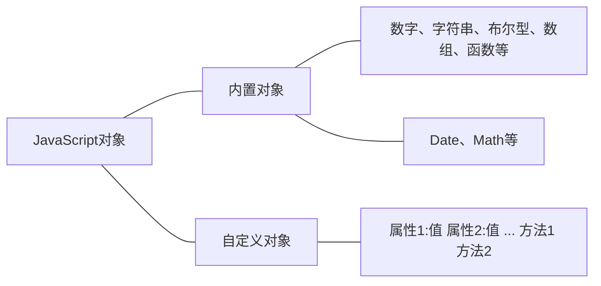
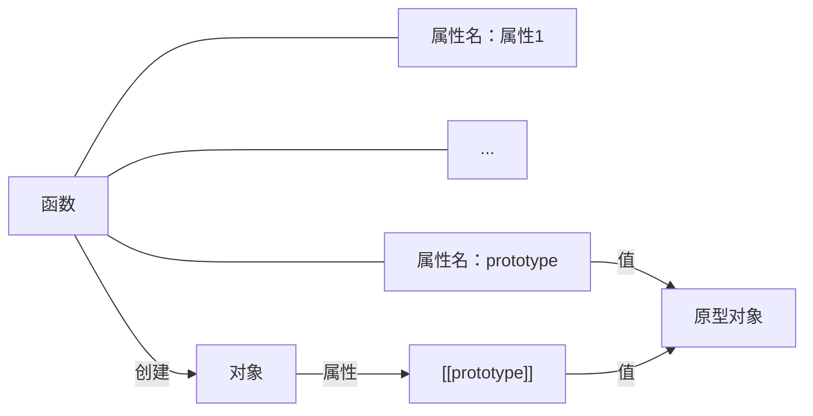

## 对象的创建

`JavaScript`是一种基于对象`（Object-based）`的语言，在`JavaScript`中，对象的创建和`Java`不同，既有`Java`使用的构造函数方式，也有其他方法。

### 对象的定义

`JavaScript`中的一切都是对象，这是该语言的一个很大的特点。像字符串、数组等已经定义的对象叫做内置对象。用户自己也可以定义对象，叫做自定义对象。本实训讲的对象特指自定义对象，自定义对象指数据和函数（又叫方法）的集合。数据指变量名和变量的值构成的组合。如下图所示：




下面介绍五种创建对象的方法，其中通过对象字面量和使用构造函数创建对象最常用。

### 对象字面量

这是最常用的创建对象的方法，通过新建一个键值对的集合（对象字面量）创建对象，如下：

```js
var song = {  
    name:"Liekkas",  
      time:180,  
      "song language":English,  
      singer: {  
        singerName:"Sofia Jannok",  
            singerAge:30  
    }  
};  
```

键值对中的键指的是属性的名字，若其中含有空格，名字需要用双引号包含在内。值指的是属性的值，可以是基本类型：如字符串，数字，布尔型，也可以是一个对象。键值对之间用逗号隔开，最后一个键值对后面没有逗号，所有的键值对在一个大括号中。

### 通过关键字new创建对象

通过`new`关键字创建对象也是一个常用的方法。如下：

```js
var Store = new Object();//创建对象的一个实例  
Store.name = "lofo Market";  
Store.location = "NO.13 Five Avenue";  
Store.salesVolume = 1000000;  
```

通过上面的代码，我们就能创建一个名为`Store`的对象。

### 通过工厂方法创建对象

工厂方法就是通过函数创建对象，函数封装了创建对象的过程。

这是一种通过函数创建对象的方法，函数封装了对象的创建过程，创建新对象时只需要调用该函数即可。这种方法适合于一次创建多个对象。

```js
//对象的创建函数  
function createStoreObject(name,location,salesVolume) {  
    var store = new Object();  
    store.name = name;  
    store.locaion = location;  
    store.salesVolume = salesVolume;  
    store.display = function() {  
          console.log(this.name);  
    };  
    return store;  
}  
//利用该函数创建一个对象  
var store1 = createStoreObject("panda express","No.1,People Street",200000);  
```

这样就创建了一个名为`store1`的对象，注意这个对象除了属性之外还有一个方法`display`。要创建更多的类似`store1`的对象，直接调用该函数即可。

### 使用构造函数创建对象

上面虽然也是通过函数创建对象，但不是构造函数，只是普通函数。构造函数名必须以大写字母开头，函数体内没有返回语句。  

```js
//构造函数  
function Store(name,location,salesVolume) {  
    this.name = name;  
    this.locaion = location;  
    this.salesVolume = salesVolume;  
}  
//创建对象的实例  
var myStore = new Store("KeyExp","No.1,L.Street",540000);  
```

上面的代码首先是`Store`对象的构造函数，然后用该构造函数创建了`Store`对象的一个实例`myStore`。

### 使用原型(prototype)创建对象

当我们创建一个函数时，函数就会自动拥有一个`prototype`属性，这个属性的值是一个对象，这个对象被称为该函数的原型对象。也可以叫做原型。

当用`new`关键字加函数的模式创建一个对象时，这个对象就会有一个默认的不可见的属性`[[Prototype]]`，该属性的值就是上面提到的原型对象。如下图所示：





`JavaScript`中每个对象都有一个属性`[[Prototype]]`，指向它的原型对象，该原型对象又具有一个自己的`[[Prototype]]`，层层向上直到一个对象的原型为`null`。根据定义，`null` 没有原型，并作为这个原型链中的最后一个环节。如下图所示：


这种方法是对使用构造函数创建对象的改进，使用构造函数创建一个对象时，会把构造函数中的方法（上面的构造函数只有属性的键值对，没有方法）都创建一遍，浪费内存，使用原型不存在这个问题。

```js
function Store() {};  
Store.prototype.name = "SF Express";  
Store.prototype.locaion = "Hong Kong";  
Store.prototype.salesVolume = 1200000000;  
//创建对象  
var myStore = new Store();  
//创建一个新的对象  
var hisStore = new Store();  
hisStore.name = "STO Express";//覆盖了原来的name属性 
```

这种方法的好处是，创建一个新的对象时，可以更改部分属性的值。

## 练习1

- 使用对象字面量方法创建名为`student`的对象，有两个属性`name`和`gender`，他们的值分别是`mainJs()`函数的参数`a`和参数`b`；
- 使用已给的构造函数`Car(plate,owner)`创建一个对象`myCar`，它的两个属性的值分别是参数`c`和参数`d`；
- 使用原型创建一个对象`myJob`，它的构造函数是`Job(company,salary)`，它的两个属性的值已经被设置，你需要用参数`e`覆盖属性`company`的值；

```js
function Car(plate,owner) {
    this.plate = plate;
    this.owner = owner;
}

function Job() {};
Job.prototype.company = "myCompany";
Job.prototype.salary = 12000;

function mainJs(a,b,c,d,e) {
	//请在此处编写代码
    /*********bigin*********/
    var student = {
        name:a,
        gender:b
    }

    var myCar = new Car(c, d);
    var myJob = new Job();
    myJob.company = e;
    /*********end*********/
    return student.name+student.gender+myCar.plate+myCar.owner+myJob.company;
}
```

## 属性的增删改查

在`Java`中，当实体类建立以后，类的属性只能获取与修改，不能增加与删除。但是因为`JavaScript`是动态类型的语言，`JavaScript`中对象的属性具有增删改查所有的操作。

### 属性的获取

#### 方式一

属性的获取有两种方式，一种是使用`.`符号，符号左侧是对象的名字，符号右侧是属性的名字，如下：

```js
var student = {name:"Alice",gender:"girl"};  
console.log(student.name);//输出Alice  
```

这种情况下属性名必须是静态的字符串，即不能是通过计算或者字符串的拼接形成的字符串。

#### 方式二

另外一种是使用`[""]`符号，符号的左边是对象的名字，双引号中间是属性的名字，这种情况下属性名可以是一个表达式，只要表达式的值是一个字符串即可。如下：

```js
var student = {name:"Alice",gender:"girl"};  
console.log(student["name"]);//输出Alice  
```

有两种情况必须使用第二种方式：

- 属性名含有空格字符，如`student["first name"]`，这时不能用`student.first name`代替，编译器无法解释后者；
- 属性名动态生成，比如用`for`循环获取前端连续`id`的值，这种`id`名之间一般有特定关系。如下面的例子：

```js
for(int i = 0;i < 5;i ++) {  
    console.log(student["id"+i]);  
}  
```

### 属性的修改与新增

属性的修改指修改已有属性的值，这个直接用赋值符号即可。

属性的新增与修改在形式上完全相同，区别仅在于编译器会根据属性的名字判断是否有该属性，有则修改，没有则新增。

```js
var student = {  
    name:"Kim",  
    age:21  
};  
student.age = 20;//修改属性，覆盖了原来的值21  
student.gender = "female";//新增属性gender  
```

### 删除属性

`JavaScript`中的属性还可以删除，这在其他的面向对象语言如`Java`或者`C++`中是无法想象的，删除通过`delete`运算符实现。删除成功返回布尔型`true`，删除失败也是返回`true`，所以在删除之前需要判断一个属性是否存在，这个内容将在下一关讲解。

需要注意的是，对象只能删除自己特有的属性，而不能删除继承自原型对象的属性。同时，对象在删除属性时，要防止删除被其他对象继承的属性，因为这样会导致程序出错。

```js
var Store = new Object();  
Store.name = "lofo Market";  
Store.location = "NO.13 Five Avenue";  
console.log(delete Store.name);//删除成功，输出true  
console.log(Store.name);//已删除，返回undefined  
delete Store.prototype;//删除失败，非自有属性  
```

## 练习2

- 如果调用函数`reviseAttribute（reviser,date,attvalue）`并传入值 `Alice,1,1000`那么对应`store`的`day1`属性的值就修改为`1000`,`accountant`属性的值修改为`Alice`；

 ```js
 var store = {
 	name:"Luma Restaurant",
 	location:"No 22,Cot Road",
 	accountant:"Vivian Xie",
 	day1:3200,
 	day2:3200,
 	day3:3200,
 	day4:3200,
 	day5:3200,
 	day6:3200,
 	day7:3200,
 	day8:3200,
 	day9:3200,
 	day10:3200
 }
 function reviseAttribute(reviser,date,attValue) {
     //Convert string to integer
     attValue = parseInt(attValue);
     //请在此处编写代码
     /*********begin*********/
 	store["day"+date] = attValue;
 	store.accountant = reviser;
 
 	/*********end*********/
     var totalSales =  store["day1"]+store["day2"]+store["day3"]+store["day4"]+store["day5"]+store["day6"]+store["day7"]+store["day8"]+store["day9"]+store["day10"];
     return totalSales+store.accountant;
 }
 ```

## 属性的检测和枚举

在`JavaScript`编程实践中，如果我们调用别人的接口，常常需要了解实体是否具有某个属性。

### 属性的检测

属性的检测指检查对象是否有某个属性或者方法，需要使用运算符`in`，`in`的左侧是属性或者方法名，右侧是检查对象，对象有该属性或者方法则返回`true`，否则返回`false`，如下：

```js
var school = {  
    name:"SJTU",  
    location:"ShangHai",  
    studentNum:40000,  
    display:function() {  
          console.log(this.name);  
    }  
};  
//检测属性  
console.log("name" in school);//输出true  
console.log("sales" in school);//输出false  
//检测方法  
console.log("display" in school);//输出true  
console.log("print" in school);//输出false  
```

这里的属性名是字符串，必须用双引号包含在内。

还可以用`hasOwnProperty()`检测对象是否具有某个自有属性或方法。括号内的参数是属性或者方法的名字。

所谓自有属性或者方法，是指对象自己定义的属性或者方法，而不是从原型链上继承来的。关于原型链，请参考本实训第一关。

```js
var school = {  
    name:"SJTU",  
    location:"ShangHai",  
    studentNum:40000,  
    display:function() {  
          console.log(this.name);  
    }  
};  
console.log(school.hasOwnProperty("studentNum"));//true  
console.log(school.hasOwnProperty("hasOwnProperty"));//false  
```

因为`hasOwnProperty`方法继承自`object`对象，不是自有方法，所以返回`false`。

### 属性的枚举

定义：属性的枚举指按顺序逐个的列出属性的名字。如下面的例子：

```js
var person = {  
    name:"Ye",  
    gender:"Gril",  
    age:23,  
    salary:23000,  
    height:1.78  
}  
```

根据前面的知识，我们知道对象`person`有五个属性，所谓枚举，就是依次列出这五个属性的名字，即：`name、gender、age、salary、height`，至于它们排列的顺序，在不同的浏览器中的结果不同，这里不讨论。

在继续下面的知识点之前，首先要知道一个概念：可枚举性（`enumerable`），这是对象的属性的一个性质，用户自己定义的属性默认为可枚举，系统内置的对象的属性默认为不可枚举。

枚举属性有三种方法：

- `for...in...`循环；
  可以枚举所有可枚举的属性，包括继承的属性。如下：

    ```js
    //首先定义一个school对象，它从原型链上继承的属性都是不可枚举的，而下面自定义的四个属性或者方法都是可枚举的  
    var school = {  
      name:"SJTU",  
      location:"ShangHai",  
      studentNum:40000,  
      display:function() {  
            console.log(this.name);  
      }  
    };  
    //枚举school的属性  
    //下面的圆括号中的att表示对象的属性，school表示对象  
    for(var att in school) {  
      //依次输出name,location,studentNum,display  
      console.log(att);  
    }  
    ```

	圆括号里面的表达式中，`att`表示对象的属性，`school`表示该对象，这个循环将依次遍历对象的所有可枚举属性，每次输出一个属性的值。

- `Object.getOwnPropertyNames()`；   括号中有一个参数，是要枚举的对象。该表达式将返回对象的所有自有属性的名字，不区分是否可枚举，结果以字符串数组的形式呈现，如下：  

	```js
	//定义一个school对象  
	var school = {  
	  name:"SJTU",  
	  location:"ShangHai",  
	  studentNum:40000,  
	  display:function() {  
	        console.log(this.name);  
	  }  
	};  
	//为school对象增加一个不可枚举的属性range  
	Object.defineProperty(school, "range", {  
	  value: 4,//设置range属性的值  
	  enumerable: false//设置range属性为不可枚举  
	});  
	//输出["name","location","studentNum","display","range"]  
	console.log(Object.getOwnPropertyNames(school));  
	```

	如果用上面的`for...in...`循环，`range`属性是不能够枚举到的。
	
- `Object.keys()`；   括号中有一个参数，是要枚举的对象。该表达式返回可枚举的自有属性，以字符串数组的形式。所以这里对属性的要求更加严格，既要求是自有属性，又要求可枚举。  

    ```js
    var school = {  
      name:"SJTU",  
      location:"ShangHai",  
      studentNum:40000,  
      display:function() {  
            console.log(this.name);  
      }  
    };  
    //为school对象增加一个不可枚举的属性range  
    Object.defineProperty(school, "range", {  
      value: 4,//设置range属性的值  
      enumerable: false//设置range属性为不可枚举  
    });  
    //输出["name","location","studentNum","display"]  
    console.log(Object.keys(school));  
    ```

总结一下上面三个方法对属性是否自有，是否可枚举的要求：

| 方法名                       | 是否要求可枚举 | 是否要求自有 |
| ---------------------------- | -------------- | ------------ |
| for...in...                  | 是             | 否           |
| Object.getOwnPropertyNames() | 否             | 是           |
| Object.keys()                | 是             | 是           |

## 练习3

- 有两个可选的对象`orange`和`car`，判断给定的属性名`a`属于哪一个对象；
- 返回该对象的所有自有属性名组成的字符串，例如：如果判断为`car`，则返回`brandpricemodel`；
- 给定的两个对象的自有属性都是可枚举的；

```js
var orange = {
    weight:"200g",
    color:"orange",
    taste:"sour"
};
var car = {
    brand:"Jaguar",
    price:"$80000",
    model:"XFL"
}
function mainJs(a){
	//请在此处编写代码
    /*********begin*********/
    var result = "";
    if (orange.hasOwnProperty(a)) {
        for (var att in orange) {
            result += att;
        }
    } else if (car.hasOwnProperty(a)) {
        for (var att in car) {
            result += att;
        }
    }

    return result;
    /*********end*********/
}
```

