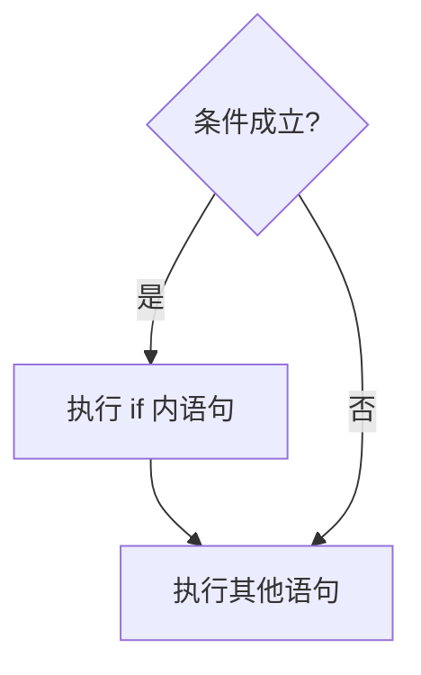
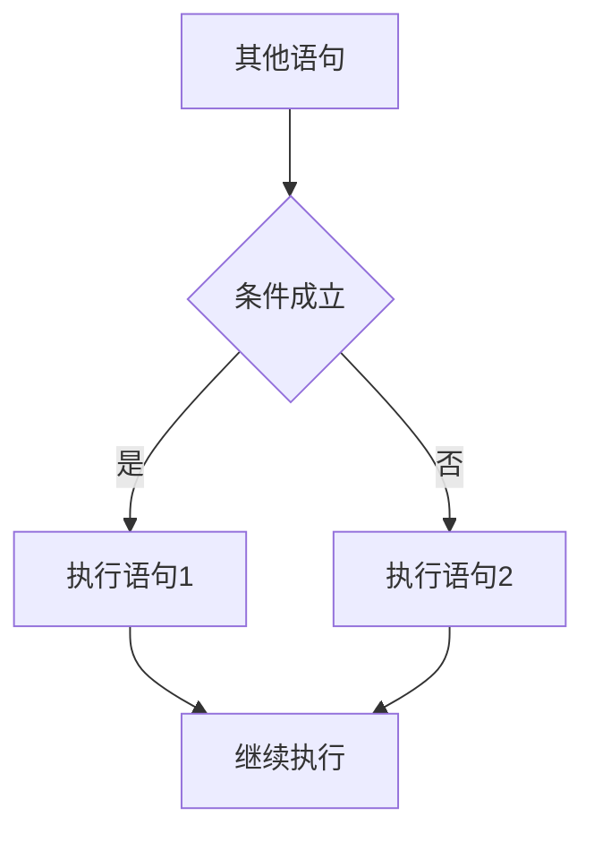

## if-else类型

在编程中，我们常常根据变量是否满足某个条件来执行不同的语句。

`JavaScript`中利用以`if`关键字开头的条件语句达到以上目的，根据`if`后面括号内表达式的计算结果来进行分支控制。

### if语句

一段完整的`JavaScript`语句相当于一条主干路，从第一句开始执行直到最后一句。而`if`语句是一条连接在干路上的支路，满足某个条件时程序进入支路中执行，执行完后回到干路。如下所示：




条件成立指`if`后面的括号内的表达式的计算结果为`true`。

`if`语句的结构为：  

```js
if(表达式)  {   
    //上面的表达式成立则执行本语句  
    语句; 
}  
```

比如下面的例子会根据`a`的正负输出相应的结果：  

```js
//求一个数的绝对值 
function abs(a) {   
    if(a < 0) {
        //如果a是负数   
        a = -a;//取反  
    }   
    return a; 
}  
```

### if-else语句

`if-else`相当于干路分成了两条支路，程序执行遇到分支的时候，必须且只能选择其中一条继续执行，结束后回到干路。如下：




条件成立时执行语句`1`，这里的语句`1`是条件成立时你希望执行的语句，条件不成立时执行语句`2`。

语句结构为：

```js
if(条件表达式)  {  
    //条件成立执行语句1  
    语句1; 
}  else  {  
    //条件不成立执行语句2  
    语句2; 
}  
```

下面是一个具体的例子：

```js
//a为正数或0返回1，a为负数返回0 
function num(a) {   
    if(a >= 0) {      
        return 1;   
    } else {    
        return 0;  
    } 
}  
```

### 匹配问题

多个`if-else`连接起来的时候会出现匹配问题，如下面的例子：  

```js
function abs(a) {   
    if(a >= 0)      
        if(a > 0)       
            a = 1;  
    else    
            a = -1;   
    return a; 
}  
```

从代码的缩进角度看来，程序中的`else`和第一个`if`实现了匹配。但是，实际上`else`匹配的是第二个`if`，因为`JavaScript`中的`else`遵循的是就近匹配，即`else`会和最近的`if`组合成一个完整的`if-else`结构。

建议：`if`语句执行部分加`{}`，防止出现 `if-else`不匹配问题。

#### 编程要求

补全代码片段中`Begin`至`End`中间的代码，具体要求如下：

- 根据分数`a`（百分制）返回考试结果；
- `a`小于`60`分返回`unpass`，否则返回`pass`；
- 本题考察非嵌套的`if-else`语句；

```js
function mainJs(a) {
    a = parseInt(a);
	//请在此处编写代码
	/********** Begin **********/
    if (a < 60) {
		return "unpass";
	} else {
		return "pass";
	}
    
	/********** End **********/
}
```

## switch类型

上一关讲解的是拥有少数分支的`if-else`结构，实际开发的过程中，还会遇到多分支的情况，比如根据电话号码判断运营商，如果用`if-else`型条件语句，代码会很长而且难以理解。所幸的是，`JavaScript`提供了另外一种选择结构：`switch`语句。

### 严格相等

在了解`switch`语句之前，先要知道严格相等的概念，严格相等的符号为`===`。

对于`JavaScript`中的内置数据类型，如数字，字符串，布尔型等。严格相等要求比较双方的数据类型和值都相等，而相等`==`只要求比较双方的值相等，因为可以进行数据类型转换。例子如下：

```js
var string = "1"; 
var number1 = 1; 
var number2 = 1; 
console.log(string === number1); 
console.log(number1 === number2);  
```

输出结果：

`false`

`true`

对于`JavaScript`中的对象类型，严格相等要求双方的引用相同，即必须是同一个对象。如果不是同一个对象，即使双方的属性、值都相同，也被认为不等，比如下面的例子：

```js
var class1 = { 
    id:251,
    name:"class" 
} 
var class2 = {
    id:251, 
    name:"class" 
} 
var class3 = class1; 
console.log(class2 === class1); 
console.log(class3 === class1);  
```

输出结果：

`false`

`true`

虽然`class1`和`class2`的属性名、属性值都相等，但是不满足严格相等，因为它们是不同的对象，指向内存的不同地方。而`class3`和`class1`严格相等，因为它们指向内存的同一个地方。

### switch语句

`switch`是一种多分支的选择结构，采用等值判断，如下是结构图，其中`T`表示条件成立，`F`表示条件不成立，箭头表示语句的执行方向。

     

`switch`语句的语法如下：  

```js
switch(表达式)  {  
    case 值1:语句1;  
        break;  
    case 值2:语句2;   
        break;    
    case 值3:语句3;  
        break;  
    default:语句;  
        break; 
}  
```

括号中的表达式计算后会得到一个值，该值会**从上到下**依次与`case`关键字后面的值比较，如果满足**严格相等**，则执行相应`case`后面的语句；如果与所有的值都不满足严格相等，则执行`default`关键字后的语句。

当和`case`后面的某一个值完成匹配并执行完语句后，需要用`break`结束整个的`switch`选择，否则会与后面的继续匹配。

```js
//函数（方法）：根据身份证号前两位判断所在省份 
function judgeProvince(idCard) {  
    switch(idCard) {     
        case 31:console.log("上海");    
            break;     
        case 32:console.log("江苏");   
            break;    
        case 33:console.log("浙江");     
            break;     
        case 34:console.log("安徽");      
            break;    
        case 35:console.log("福建");     
            break;     
        case 36:console.log("江西");   
            break;     
        case 37:console.log("山东");   
            break;    
        default:console.log("未知");     
            break;  
    } 
}  //调用上面的函数  judgeProvince(36);//输出“江西”  
```

如果不加`break`，代码会从满足`switch`条件的地方开始执行，一直执行到最后，不符合的`case`后面的语句也会被执行。

下面的例子根据输入的分数计算绩点`（GPA）`：  

```js
//函数（方法）：根据百分制的成绩计算GPA 
function calGrade(grade) {   
    grade = parseInt(grade/10);//除以10后取整数  
    var gpa;  
    switch(grade) {    
        case 10://注意这后面没有break   
        case 9: gpa = 4;break;//90到100均为4   
        case 8: gpa = 3;break;     
        case 7: gpa = 2;break;      
        case 6: gpa = 1;break;   
        default: gpa = 0;break;   
    }    
    return gpa; 
}  
//调用上面的函数 
console.log(calGrage(100));//输出4  
```

当`grade`为`10`的时候，没有`break`，会往下一直执行；执行到`grade`为`9`的时候，有`break`，会终止`switch`语句块，此时 `gpa`被赋值`4`，所以`90`到`100`分的返回值都是`4`。

#### 编程要求

北美五大湖的名称和面积如下：

| 名称     | 面积(平方公里) |
| -------- | -------------- |
| Superior | 82414          |
| Huron    | 59600          |
| Michigan | 58016          |
| Erie     | 25744          |
| Ontario  | 19554          |

补全代码片段中`Begin`至`End`中间的代码，具体要求如下：

- 根据面积参数`a`返回湖泊的名字，湖泊的名称和面积的对照表在最上面的任务描述里面，这里不再赘述；
- 没有对应的湖泊返回`error`；

```js
function mainJs(a) {
    a = parseInt(a);
	//请在此处编写代码
	/********** Begin **********/
	var result;
    switch(a) {
		case 82414: result = "Superior";
		break;
		case 59600: result = "Huron";
		break;
		case 58016: result = "Michigan";
		break;
		case 25744: result = "Erie";
		break;
		case 19554: result = "Ontario";
		break;
		default: result = "error";
		break;
	}
    
	return result;
	/********** End **********/
}
```

## 综合练习

### 第一题

完成函数`judgeLeapYear(year)`，功能是判断某一年是否为闰年，是则返回“`xxx`年是闰年”，否则返回“`xxx`年不是闰年”。参数`year`是表示年份的四位数整数。

判断闰年的过程如下：  

     

效果如下：
当`year`等于`2000`，该函数返回“`2000`年是闰年”。

### 第二题

完成函数`normalizeInput(input)`，功能是对输入的字符串进行规范化，参数`input`是输入的字符串，返回规范化后的字符串，规范化的标准如下：

| input        | 输出         |
| ------------ | ------------ |
| 中共党员     | 中共党员     |
| 党员         | 中共党员     |
| 共产党员     | 中共党员     |
| 中共预备党员 | 中共预备党员 |
| 预备党员     | 中共预备党员 |
| 团员         | 共青团员     |
| 共青团员     | 共青团员     |
| 大众         | 群众         |
| 群众         | 群众         |
| 市民         | 群众         |
| 人民         | 群众         |
| （其他数据） | 错误数据     |

注：篇幅有限，这里不单独列出民主党派和无党派人士。

效果如下：
当`input`等于“市民”，返回“群众”。

### 第三题

完成函数`evaluateApple(weight,water)`，功能是判断苹果是否为优质品，是则返回“是优质品”，否则返回“不是优质品”。参数`weight`表示重量（克），为整数；参数`water`表示含水量，为小数。

判断标准如下：  

- `weight`大于等于`200`，为优质品；
- `weight`小于`200`，但`water`大于等于`0.7`为优质品；
- 其余不是优质品。

效果如下：
`weight`为`220`，`water`为`0.6`，返回“是优质品”。

```js
//判断一个年份是否为闰年
function judgeLeapYear(year) {
	//请在此处编写代码
	/********** Begin **********/
    year = parseInt(year);
	if (year % 400 == 0 || (year % 4 == 0 && year % 100 != 0)) {
		return year + "年是闰年";
	} else {
		return year + "年不是闰年";
	}
	/********** End **********/
}

//对输入进行规范化处理
function normalizeInput(input) {
	/********** Begin **********/
	var result;
    switch(input) {
		case "中共党员": 
		case "党员":
		case "共产党员": result = "中共党员";
		break;
		case "中共预备党员":
		case "预备党员": result = "中共预备党员";
		break;
		case "团员":
		case "共青团员": result = "共青团员";
		break;
		case "大众":
		case "群众":
		case "人民":
		case "市民": result = "群众";
		break;
		default: result = "错误数据";
	}

	return result;
    
	/********** End **********/
}

//判断苹果是否为优质品
function evaluateApple(weight,water) {
	/********** Begin **********/
	weight = parseInt(weight);
	water = parseFloat(water);
    var result;
	if (weight >= 200) {
		result = "是优质品";
	} else {
		if (water >= 0.7) {
			result = "是优质品";
		} else {
			result = "不是优质品";
		}
	}
    
	return result;
	/********** End **********/
}
```

