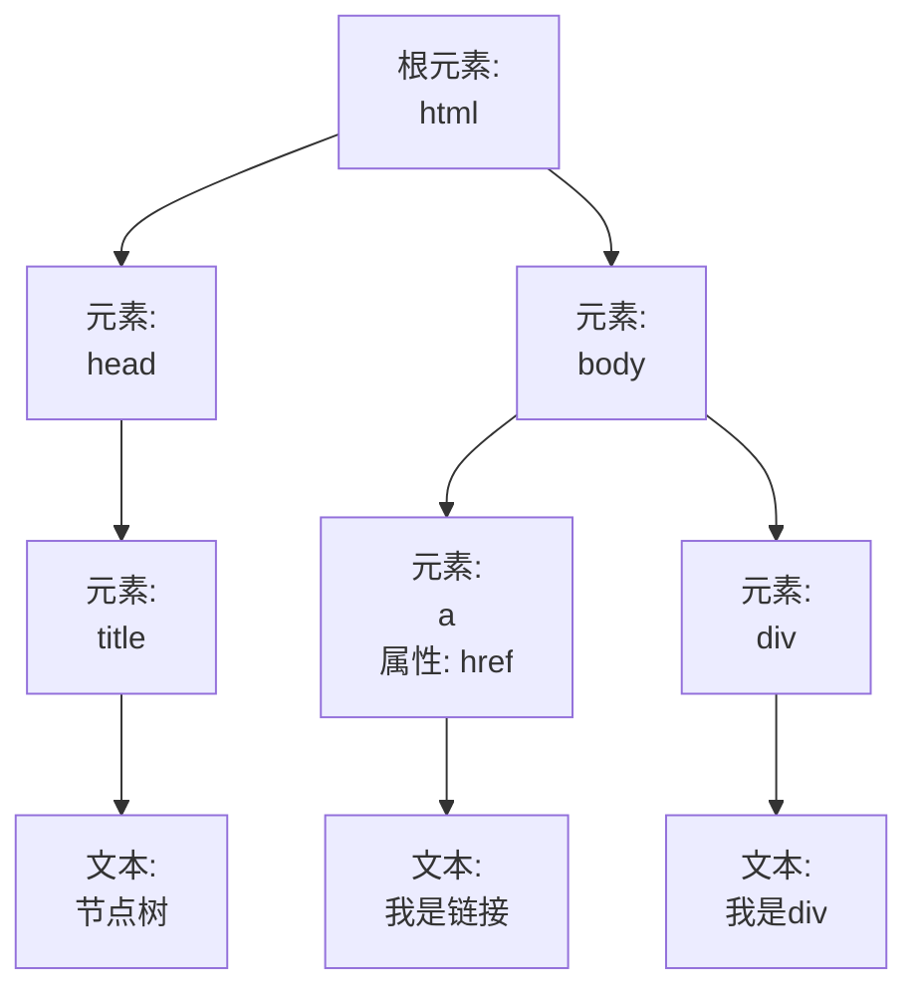

## 遍历DOM元素的祖先元素

### 节点树

基本的`html`结构如下：  

```html
<!doctype html> 
<html lang="en"> 
    <head>    
        <meta charset="UTF-8">  
        <title>节点树</title> 
    </head> 
    <body>   
        <div>我是div</div>  
        <a href="#">我是链接</a> 
    </body> 
</html>  
```

把它转换成`DOM`节点树的效果图如下：  




说明：  

- 每个`html`元素都是元素节点，`html`元素内的文本是文本节点；
- 在节点树中，顶端节点叫根节点，每个节点都有父节点（除了根节点）。这里`html`是根节点， `<head>`的父节点是`<html>`，`<title>`的父节点是`<head>`节点；
- 一个节点可拥有任意数量的子节点。比如：`<body>`拥有子节点`<a>`和`<div>`，这里只是举例，`<body>`还可拥有其他的节点；
- 兄弟节点是拥有相同父节点的节点。比如： `<a>`和`<div>`就是兄弟节点，因为它们拥有相同的父节点`<body>`。

### 向上遍历DOM节点

基本的`html`结构如下（`CSS`已省略）：

```html
<div>div (曾祖父元素)   
    <ul>ul (祖父元素)   
        <li>li (父元素)     
            <span>span</span>    
        </li>  
    </ul>
</div>  
```

效果图如下：

     

### parent()

如何给`span`元素的**父元素**设置背景色呢？这里用`parent()`获取父元素。代码如下：

```js
$("span").parent().css("background", "lightgreen");  
```

效果图如下：

     

从上面可以看出: `parent()`会返回被选元素的直接父元素；

如果给`span`元素的**祖父元素**设置背景色呢？利用`jQuery`链式调用的特点，再加一个`parent()`就可以了。代码如下：

```js
$("span").parent().parent().css("background","orange");  
```

效果图如下:

     

如果给`span`元素的**所有祖先元素**设置背景色呢？ 这里用`parents()`来实现，代码如下：

```js
$("span").parents().css("background","orange");  
```

效果如下:

     

从上面可以看出：`parents()`会返回被选元素的所有祖先元素，直到根元素`<html>`。

### 编程要求

在`Begin`至`End`之间填充代码，运用本节学到的方法实现下面的效果。要求如下:

- 本节操作的元素是`p`元素；
- 设置`div`元素的背景色为`#fff`；
- 设置`body`元素的背景色为`#ccc`。

格式注意：

- 获取元素统一用**类名**获取；
- 统一用双引号`""`表示字符串。

效果如下：

     

```html
<!doctype html>
<html lang="en">
<head>
    <meta charset="UTF-8">
    <title>Document</title>
    <script src="https://code.jquery.com/jquery-3.3.1.min.js"></script>

    <style>
    .container{
        width: 300px;
        margin: 30px auto;
        border: 2px solid #000;
    }
    .item{
        font-size: 60px;
        text-align: center;
        color: red;
    }
    </style>
</head>
<body>
    <div class="container"> 
         <p class="item">
              404
         </p>
    </div>
   <script>

    $(function(){        
        //------------ Begin -----------
        $(".item").parents().css("background", "#ccc");
        $(".item").parent().css("background", "#fff");
        //------------ End --------------
    })

   </script>
</body>
</html>
```

## 遍历DOM元素的后代元素

### 向下遍历DOM节点

基本的`html`结构如下（`CSS`已省略）：

```html
<div>div (当前元素)   
    <p>p (儿子元素)  
        <span>span(孙子元素)</span>   
    </p> 
</div> 
<div>div(父元素) 
    <ul>ul(儿子元素)     
        <li>li(孙子元素)     
            <span>span(曾孙子元素)</span>    
        </li>   
    </ul> 
</div>  
```

效果图如下：

     

### children()

如何给`p`元素和`ul`元素同时设置背景色呢？ 可以发现它们都是`div`的子元素，这里用`children()`。代码如下：

```js
$("div").children().css("background", "lightgreen");  
```

效果图如下：

     

从上面可以看出： `children()`会返回被选元素的**所有直接子元素**。

### find()

如何给`div`下的`span`元素修改背景色呢？ 这里用`find()`来实现，代码如下：

```js
$("div").find("span").css("background","orange");  
```

效果如下：

     

从上面可以看出：`find()`会从被选元素开始查找，一直向下，直到最后一个后代元素。

### 编程要求

在`Begin`至`End`之间填充代码，运用本节学到的方法实现下面的效果。要求如下：

- 本节操作的元素是`div`元素；
- 设置`p`元素的背景色为`red`；
- 设置`span`元素的字体颜色为`#fff`。

格式注意：

- 获取元素统一用**类名**获取；
- 统一用双引号`""`表示字符串。

效果如下：

     

```html
<!doctype html>
<html lang="en">
<head>
	<meta charset="UTF-8">
	<title>Document</title>
    <script src="https://code.jquery.com/jquery-3.3.1.min.js"></script>
	<style>
    .container{
        width: 200px;
        margin: 20px auto;
    }
    .box{
    	width: 200px;
        line-height: 140px;
    	background: orange;
    	text-align: center;
        font-size: 60px;
    }
    </style>
</head>
<body>
	<div class="container">
	    <p class="box">
	    	<span class="item">
	    	KO!
	    	</span>
	    </p>
    </div>

    <script>
     $(function(){
         //----------------- Begin -----------------
         $(".container").children().css("background", "red");
        $(".container").find(".item").css("color", "#fff");
         //----------------- End --------------------
     })
    </script>
</body>
</html>
```

## 遍历DOM元素的兄弟元素

### siblings()

如何给`span`元素的所有兄弟元素设置背景色呢？ 这里用`siblings()`。代码如下：

```js
$("span").siblings().css("background","orange")
```

效果如下：

     

从上面可以看出：`siblings()` 方法会返回被选元素的所有兄弟元素。

### next()

如何给`span`元素的后一个兄弟元素设置背景色呢？ 这里用`next()`。代码如下：

```js
$("span").next().css("background","orange")
```

效果如下：

     

从上面可以看出：`next()` 方法会返回被选元素的后一个兄弟元素。

### nextAll()

如何给`span`元素后的所有兄弟元素设置背景色呢？ 这里用`nextAll()`。代码如下：

```js
$("span").nextAll().css("background","orange")
```

效果如下：

     

从上面可以看出：`nextAll()` 方法会返回被选元素后的所有兄弟元素。

### prev() 和 prevAll()

`prev()`和`next()`相对应，它返回的是被选元素的前一个兄弟元素。

`prevAll()`和`nextAll()`相对应，它返回的是被选元素前的所有兄弟元素。

### 编程要求

在`Begin`至`End`之间填充代码，**遍历`class="item"`元素的兄弟元素**。要求如下：

- 这里只用`siblings(), pre(), prevAll(), next()` 来实现下面效果，注意使用的先后顺序，因为颜色会覆盖；
- 设置`p`元素的颜色为`red`；
- 设置`span`元素的颜色为`orange`；
- 设置`ul`元素的颜色为`green`；
- 设置`ol`元素的颜色为`cyan`。

格式注意：

- 获取元素统一用**类名**获取；
- 统一用双引号`""`表示字符串。

效果如下：

     

```html
<!doctype html>
<html lang="en">
<head>
    <meta charset="UTF-8">
    <title>Document</title>
    <script src="https://code.jquery.com/jquery-3.3.1.min.js"></script>

    <style>
    .container{
        width: 400px;
        margin: 20px auto;
    }
    .container *{
        display: block;
        border: 2px solid #000;
        padding: 5px;
        margin: 15px;
    }

    </style>
</head>
<body>
<div class="container">
    <p>p元素</p>
    <span>sapn元素</span>
    <h3 class="item">h3元素</h3>
    <ul>ul元素</ul>
    <ol>ol元素</ol>
</div>

    <script>
     $(function(){
        $(".item").css("background","yellow");
         
        //------------ Begin --------------
        $(".item").siblings().css("background", "cyan");
        $(".item").prevAll().css("background", "red");
        $(".item").prev().css("background", "orange");
        $(".item").next().css("background", "green");
        //-------------- End ---------------

     })
    </script>
    
</body>
</html>
```

## 过滤

### first()

如何给`div`下的第一个`p`元素设置背景色呢？ 这里用`first()`。代码如下：

```js
$("div p").first().css("background","orange");  
```

效果如下：

     

从上面可以看出：`first()` 方法会返回被选元素的第一个元素。

还记得学过的过滤选择器吗？也是可以实现相同效果的。代码如下：

```js
$("div p:first").css("background","orange");  
```

### last()

如何给`div`下的最后一个`p`元素设置背景色呢？ 这里用`last()`。代码如下：

```js
$("div p").last().css("background","orange");  
```

效果如下：

     

从上面可以看出：`last()` 方法会返回被选元素的最后一个元素。

用过滤选择器实现代码如下：

```js
$("div p:last").css("background","orange");  
```

### eq()

如何给`div`下的第三个`p`元素设置背景色呢？ 这里用`eq()`。代码如下：

```js
$("div p").eq(2).css("background","orange");  
```

效果如下：

     

从上面可以看出：`eq()` 方法会返回带有指定索引号的元素。
注意：**索引是从`0`开始的**。

用过滤选择器实现代码如下：

```js
$("div p:eq(2)").css("background","orange");  
```

### filter()

如何给`div`下`class="active"`的`p`元素设置背景色呢？ 这里用`filter()`。代码如下：

```js
$("div p").filter(".active").css("background","orange");  
```

效果如下：

     

从上面可以看出：`filter()` 方法会规定一个标准，匹配的会被返回，不匹配的不返回。

用选择器实现代码如下：

```js
$("div p.active").css("background","orange");  
```

### not()

如何给`div`下**没有**`class="active"`的`p`元素设置背景色呢？ 这里用`not()`。代码如下：

```js
$("div p").not(".active").css("background","orange");  
```

效果如下：

     

从上面可以看出：`not()` 方法会返回不匹配的元素，和`filter()`相反。

用过滤选择器实现代码如下：

```js
$("div p:not(.active)").css("background","orange");  
```

### 编程要求

根据提示，在`Begin`至`End`之间填充代码，修改指定元素的字体颜色。要求用本节介绍的方法，过滤选择器可自行调试。要求如下：

- 获取第一个`p`元素，改变字体颜色为`red`；
- 获取匹配`class="active"`的`p`元素，改变字体颜色为`orange`；
- 获取第三个`p`元素，改变字体颜色为`yellow`；
- 获取没有`class="item"`的`p`元素，改变字体颜色为`green`；
- 获取最后一个`p`元素，改变字体颜色为`blue`。

格式注意：

- 获取元素统一用**类名**获取，直接获取即可；
- 统一用双引号`""`表示字符串。

效果如下：

     

```html
<!doctype html>
<html lang="en">
<head>
    <meta charset="UTF-8">
    <title>Document</title>
    <script src="https://code.jquery.com/jquery-3.3.1.min.js"></script>

    <style>
    .container{
        width: 400px;
        margin: 20px auto;
    }
    .container *{
        display: block;
        border: 2px solid #000;
        padding: 5px;
        margin: 15px;
    }

    </style>
</head>
<body>
<div class="container">
    <p class="item">我是第一个元素</p>
    <p class="item active">我是第二个元素</p>
    <p class="item">我是第三个元素</p>
    <p class="four">我是第四个元素</p>
    <p class="item">我是第五个元素</p>
</div>

    <script>
     $(function(){
      //---------- Begin ------------
        $(".item").first().css("color", "red");
        $(".item").filter(".active").css("color", "orange");
        $(".item").eq(2).css("color", "yellow");
        $(".four").not(".item").css("color", "green");
        $(".item").last().css("color", "blue");
        
      //----------- End -------------
     })
    </script>
    
</body>
</html>
```

