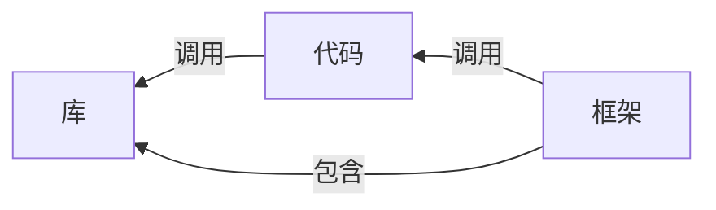

# Spring-Overview

### 学习目标

- 了解框架是什么，理解框架与第三方库的区别
- 了解 Spring 和 Spring Boot 的基础概念，以及两者之间的关系
- 能够通过 Spring Initializr 按照要求创建 Spring Boot 项目并运行

### 学习内容

- Spring Overview
  - 什么是框架
  - Spring 简介
  - Spring Boot 简介
  - 创建一个 Spring Boot 项目

## 什么是框架

框架是一个可复用的结构，它提供一些通用功能。

三者之间的关系

*You tell libraries what to do, frameworks tell you what to do.*

优点

* 提供构建大型应用所需要的组件
* 升级和维护有保障
* 提供最佳实践

缺点

* 更长的加载时间和性能下降
* 让事情更复杂
* 新版本可能导致现在的代码需要修改

## Spring介绍

Spring makes java simple.