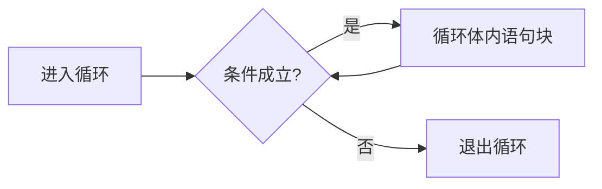
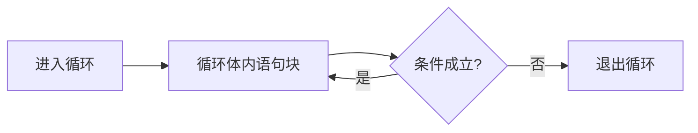
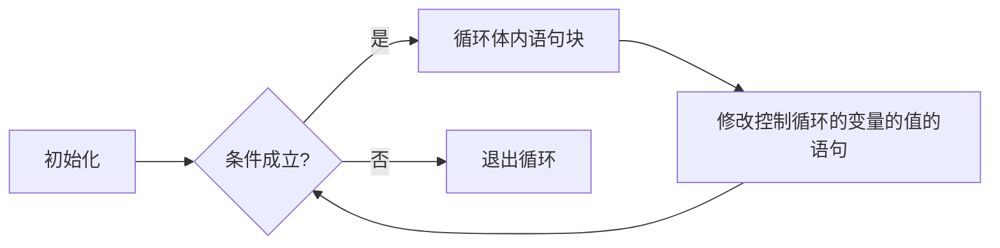

# JavaScript循环语句

## while类型

在选择结构中，条件会被测试一次，成立则执行`if`内语句，结束后回到主线执行下一条语句。循环结构在执行结束后会**再次**判断条件是否成立，这样一直重复下去**直到条件不成立**。

`while`类型的循环结构如下：

```js
while(条件表达式)  { 
    //条件成立执行里面的语句 
}  
```

和条件语句一样，循环语句先判断条件表达式是否成立，如果成立，执行大括号内部的语句块；如果不成立则直接跳过循环体。如下：  




​	

语句块执行结束后，再次**回到**条件表达式，判断表达式是否成立，成立则执行大括号内语句块，不成立执行循环体外下一句。这个过程会一直**重复进行**，直到条件表达式不再成立为止，也就是说，大括号内的语句块有可能被执行多次。

在执行大括号内的语句块的过程中，条件表达式内的某些变量的值会被改变，等到下一次执行的时候条件表达式有可能不再成立。这样循环会在有限的次数内结束。

输出`100`以内的偶数的例子：

```js
var i = 0; 
while(i <= 100) {   
    console.log(i);   
    i = i+2;//条件表达式里面变量i的值改变了 
}  
```

在上面的例子中，条件表达式中的`i`变量会在循环体内被加上`2`，这样总会在某个循环时，条件表达式不再成立，循环结束。

----

补全代码片段中`Begin`至`End`中间的代码，具体要求如下：

- 求出小于等于整数`a`的所有质数；
- 计算并返回所有这些质数的和；

```js
function mainJs(a) {
    a = parseInt(a);
	//请在此处编写代码
	/********** Begin **********/
    var result = 0;
	var i = 2;
	while (i <= a) {
		var j = 2;
		while(j < i) {
			if (i % j == 0) {
				break;
			}
			j++;
		}
		if (j == i) {
			result += i;
		}
		i++;
	}
	return result;
	/********** End **********/
}
```

## do while类型

`do whle`类型会在循环体的**末尾**判断条件表达式是否成立，也就是说，循环体内的语句**至少会执行一次**。结构如下：  

```js
do  { 
    //循环体内的语句 
}  while(条件表达式);  
```

第一遍循环体内的语句执行结束后，检测条件表达式的返回值，如果返回`true`将会第二次执行循环体，返回`false`结束循环，如下：  



还是第一关中的例子，输出`100`以内的偶数，我们换一种解决方案：  

```js
var i = 0; 
do{    
    console.log(i);   
    i = i+2; 
} while(i <= 100);  
```

这种`do while`循环适合用在循环体至少会被执行一次的场景。

----

补全代码片段中`Begin`至`End`中间的代码，具体要求如下：

- 求出并返回参数`a`和`b`之间的所有整数的和，不包括这两个端点；

```js
function mainJs(a,b) {
    a = parseInt(a);
    b = parseInt(b);
	//请在此处编写代码
	/********** Begin **********/
    var result = 0;
	var i = a + 1;
	while(i < b) {
		result += i;
		i++;
	}

	return result;
	/********** End **********/
}
```

## for类型

`while`和`do while`的一个缺点是循环的次数不够直观，需要通过计算表达式何时返回`false`确定。`JavaScript`提供了新的循环结构：`for`型，这种结构把条件表达式和循环次数**并列**书写，便于控制循环次数。

`for`型循环的结构如下：

```js
for(初始化;条件表达式;修改值)  { 
    //条件表达式成立执行的语句块  
}  
```

初始化、条件表达式、修改值都操作控制循环次数的变量，初始化对该变量赋一个**初值**，紧接着**执行**条件表达式，如果返回`true`则进入循环体内，否则直接跳过循环体。如下：




循环体内执行结束后，修改值操作会修改变量的值，紧接着再次执行条件表达式，根据返回值决定是否进入循环体，这个步骤会一直重复进行下去，**直到**条件表达式返回`false`，循环结束。

初始化只执行一次，条件表达式在每一次进入循环体之前执行，修改值在每次执行完循环体之后进行。这三个式子都可以没有，但是整个括号内必须有**两个分号**。

还是以上一关中的输出小于等于`100`的偶数为例子：

```js
for(var i = 0;i <= 100;i+=2) {  
    console.log(i); 
}  
```

与上一关不同的是，这里变量`i`的初始化和增加都是在括号内，循环体内只有一句。

----

补全代码片段中`Begin`至`End`中间的代码，具体要求如下：

- 计算并返回整数`a`的“倒数”；

```js
function mainJs(a){
    a = parseInt(a);
	//请在此处编写代码
	/********** Begin **********/
    // 此例子欠佳，用 while 循环更合适
	var result = 0;
	while (a > 0) {
		result *= 10;
		result += (a % 10);
		a = Math.floor(a / 10);
	}
	
    return result;
	/********** End **********/
}
```

## for in类型

`JavaScript`的`for in`循环主要用于**枚举**对象的**可枚举属性名**，可枚举属性的定义请参考《`JavaScript`学习手册四：`JS`对象》。

对象类型是键值对的集合，键指的是属性的名字，值指的是属性的值。

`for in`除了枚举对象自己拥有的可枚举属性外，还会枚举**继承**的可枚举属性。

```js
var orange = {   
    color:"orange",   
    weight:200,    
    location:"GanZhou",  
    date:"October" 
}; 
for(var att in orange) {   
    console.log(att);//依次输出color,weight,location,date 
}  
```

> 注意：上述代码中，att 是临时变量，可以是其他名称。

----

补全代码片段中`Begin`至`End`中间的代码，具体要求如下：

- 求出`apple`对象所有表示产地的属性的值（这些值都是字符串），然后拼接这些值，并返回；
- 注意我们有可能通过参数`a`和`b`给`apple`添加新的表示产地的属性，也有可能修改已有的属性的值，所以不要投机取巧哦；
- 提示：`a.indexOf("location")`的结果如果为`0`，表示字符串`a`以`location`开头；

```js
var apple = {
    weight:"200克",
    level:"特级",
    locationProvince:"陕西省",
    locationCity:"榆林市"
}
function mainJs(a,b){
    apple[a]= b;
	//请在此处编写代码
	/********** Begin **********/
    var result = "";
    for (var att in apple) {
        if (att.indexOf("location") == 0) {
            result = result + apple[att];
        }
    }

    return result;
    
	/********** End **********/
}
```

## break和continue的区别

前面介绍了四种循环结构，这些结构都是建立在**已知循环次数**的基础上。在很多情况下，不能确定循环次数，即循环会在进行到满足某个特定的条件时结束。比如，当数组中出现第二个整数`0`时，结束元素的输出。这些情况下就需要使用`break`和`continue`关键字帮助**结束循环**。本节介绍关键字`break`。

### break

`break`的作用是**跳出循环**，跳过循环体内`break`下面的所有语句以及剩余的所有循环，而直接执行循环体外下面的第一句。`break`通常和`if`条件语句一起使用，表示满足该条件时结束循环。

```js
for(;;)  { 
    if(条件语句) break; 
}  //满足条件时直接跳到这里执行  
```

下面的例子输出一个数组，当遇到数组中第一个负数时，结束输出。

```js
//下面的整个程序将依次输出12,23,满足条件直接执行我这里！
var arr = [12,23,-1,45,2,0,-1]; 
for(var i = 0;i < arr.length;i++) {   
    if(arr[i] < 0) break; 
    console.log(arr[i]); 
} 
console.log("满足条件直接执行我这里！");  
```

----

补全代码片段中`Begin`至`End`中间的代码，具体要求如下：

- 返回数组`arr`中第一个质数；

```js
function mainJs(a) {
    var arr = a.split(",");
    for(var k = 0,length = arr.length;k < length;k++) {
        arr[k] = parseInt(arr[k]);
    }
	//请在此处编写代码
	/********** Begin **********/
    for (var i = 0; i < arr.length; i++) {
        var curNum = arr[i];
        
        var j = 2;
        for (var k = 2; k < curNum; k++) {
            if (curNum % k == 0) {
                break;
            } else {
                j++;
            }
        }

        if (curNum == j) {
            return curNum;
        }
    }

    return 0;
    
	/********** End **********/
}
```

### continue

`continue`是一个和`break`含义十分接近的关键字，本节将详细剖析`continue`的用法。

`continue`的作用是结束**本次**循环，即循环体内`continue`下面的语句不再执行，直接进入**下一个循环周期**。

比如上一关的例子中，原要求是遇到第一个负数时结束输出。现在把要求改成：输出数组中的所有正数。这个时候就需要用到`continue`语句。

```js
//只输出所有的正数，程序将依次输出12,23,45,2 
var arr = [12,23,-1,45,2,0,-1]; 
for(var i = 0;i < arr.length;i++) {    
    if(arr[i] <= 0) continue;  
    console.log(arr[i]); 
}  
```

----

补全代码片段中`Begin`至`End`中间的代码，具体要求如下：

- `a`是一个数字数组，`b`是非零整数；
- 如果`b`为正数，计算`a`中所有正数的和；如果`b`是负数，计算`a`中所有负数的和；

```js
function mainJs(a,b) {
    a = a.split(",");
    for(var i = 0,length = a.length;i < length;i++) {
        a[i] = parseInt(a[i]);
    }
    var sum = 0;
    for(var i = 0,length = a.length;i < length;i++) {
	//请在此处编写代码
	/********** Begin **********/
        if (b > 0) {
            if (a[i] < 0) {
                continue;
            }
        } else if (b < 0) {
            if (a[i] > 0) {
                continue;
            }
        }
    
	/********** End **********/
        sum += a[i];
    }
    return sum;
}
```

