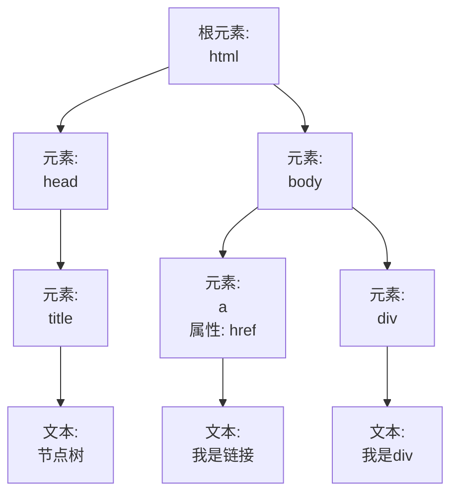

# jQuery选择器

## jQuery 基本选择器

```html
<div id="box1">我是id选择器</div>  
<p class="box2"></p> 
<span></span>  
```

> 这里选择器用的符号与 CSS 中的选择器相同。
>
> 即 id 选择器使用 `#` 符号，类选择器使用 `.` 符号，元素选择器没有特殊的标志，直接输入 tag 名即可。

### id选择器

对于上面 `id="box1"`的 `div`，如何获取它的内容呢？ 用`jquery`实现如下：  

```js
var box1 = $("#box1"); 
box1.html();  
```

效果如下（下面`div`获取上面`div`的内容）：

     

从上面可以看出，id 选择器语法： `$("# + idName")`

这里再**提醒**一下：`html()`： `()`里有内容，表示往该元素添加内容，没有内容，表示获取内容。

### 类选择器

对于上面 `class="box2"`的 `p`，如何填充内容 `我是类选择器`呢？ 用`jQuery` 实现如下：

```js
var box2 = $(".box2"); 
box2.html("我是类选择器");  
```

     

从上面可以看出，类选择器语法：` $(". + className")`

### 元素选择器

对于上面 `<span></span>`，如何填充内容 `我是元素选择器`呢？ 用`jQuery`实现如下：

```js
var box3 = $("span"); 
box3.html("我是元素选择器");  
```

     

从上面可以看出，元素选择器语法：` $("tagName")`

----

- 用`id`选择器，获取`id="box"`的div，添加内容为`我是id选择器添加的内容`；
- 用类选择器，获取`class="box"`的div，添加内容为`我是类选择器添加的内容`；
- 用元素选择器，获取 `p` 标签，添加内容为`我是元素选择器添加的内容`。

提示：

- `$(this)`指的是当前操作的`DOM`元素。

     

```html
<!doctype html>
<html lang="en">
<head>
	<meta charset="UTF-8" />
	<title>Document</title>
	<script src="https://code.jquery.com/jquery-3.3.1.min.js"></script>
</head>
<body>
    <ul class="container">
    	<li class="item">
    		<button>id</button>
    		<div id="box"></div>
    	</li>
    	<li class="item">
    		<button>类</button>
    		<div class="box"></div>
    	</li>
    	<li class="item">
    		<button>元素</button>
    		<p></p>
    	</li>
    </ul>
    <script>
    
    $(function(){
    	
    	$("button").click(function(){
    		//inner是当前点击的button元素的内容
    		var inner = $(this).html();
            // IDE 提示，这里使用 == 可能引发错误，建议使用 ===
    		if(inner === "id"){
    			//----------begin----------
    			$("#box").html("我是id选择器添加的内容");
    			//----------end------------
    		}
    		if(inner === "类"){
    			//----------begin----------
    			$(".box").html("我是类选择器添加的内容");
    			//----------end------------
    		}
    		if(inner === "元素"){
    			//----------begin----------
    			$("p").html("我是元素选择器添加的内容");
    			//----------end------------
    		}
    	})
    })

    </script>  
    <style>
    	ul,li{
    		list-style-type: none;
    	}
    	.container{
    		width: 400px;
    		margin: 40px auto;
    	}
    	.container .item{
    		height: 60px;
    		line-height: 60px;
    		margin: 0 20px 20px 0;
    		overflow: hidden;
    	}
    	.container .item button{
    		float:left;
    		width: 60px;
    		line-height: 40px;
    		text-align: center;
    		font-size: 18px;
    		margin-right: 20px;
    	}
    	.container .item div{
    		width: 240px;
    		height: 40px;
    		line-height: 40px;
    		border: 2px solid #ccc;
    		text-align: center;
    		float: left;
    	}
    	.container .item p{
    		width: 240px;
    		height: 40px;
    		line-height: 40px;
    		border: 2px solid #ccc;
    		text-align: center;
    		margin-top: 0px;
    		float: left;
    	}
    </style>
</body>
</html>

```

## 访问DOM元素的祖先元素

### 节点树

基本的`html`结构如下：  

```html
<!doctype html> 
<html lang="en"> 
    <head>    
        <meta charset="UTF-8">  
        <title>节点树</title> 
    </head> 
    <body>   
        <div>我是div</div>  
        <a href="#">我是链接</a> 
    </body> 
</html>  
```

把它转换成`DOM`节点树的效果图如下：  




- 每个`html`元素都是元素节点，`html`元素内的文本是文本节点；
- 在节点树中，顶端节点叫根节点，每个节点都有父节点（除了根节点）。这里`html`是根节点， `<head>`的父节点是`<html>`，`<title>`的父节点是`<head>`节点；
- 一个节点可拥有任意数量的子节点。比如：`<body>`拥有子节点`<a>`和`<div>`，这里只是举例，`<body>`还可拥有其他的节点；
- 兄弟节点是拥有相同父节点的节点。比如： `<a>`和`<div>`就是兄弟节点，因为它们拥有相同的父节点`<body>`。

### parent()

基本的`html`结构如下（`CSS`已省略）：

```html
<div>div (曾祖父元素)   
    <ul>ul (祖父元素)   
        <li>li (父元素)     
            <span>span</span>    
        </li>  
    </ul>
</div>  
```

     

如何给`span`元素的**父元素**设置背景色呢？这里用`parent()`获取父元素。代码如下：

```js
$("span").parent().css("background", "lightgreen");  
```

     

从上面可以看出: `parent()`会返回被选元素的直接父元素；如果给`span`元素的**祖父元素**设置背景色呢？利用`jQuery`链式调用的特点，再加一个`parent()`就可以了。代码如下：

```js
$("span").parent().parent().css("background","orange");  
```

     

如果给`span`元素的**所有祖先元素**设置背景色呢？ 这里用`parents()`来实现，代码如下：

```js
$("span").parents().css("background","orange");  
```

     

从上面可以看出：`parents()`会返回被选元素的所有祖先元素，直到根元素`<html>`。

----

- 本节操作的元素是`p`元素；
- 设置`div`元素的背景色为`#fff`；
- 设置`body`元素的背景色为`#ccc`。

格式注意：

- 获取元素统一用**类名**获取；
- 统一用双引号`""`表示字符串。

     

```html
<!doctype html>
<html lang="en">
<head>
    <meta charset="UTF-8">
    <title>Document</title>
    <script src="https://code.jquery.com/jquery-3.3.1.min.js"></script>

    <style>
    .container{
        width: 300px;
        margin: 30px auto;
        border: 2px solid #000;
    }
    .item{
        font-size: 60px;
        text-align: center;
        color: red;
    }
    </style>
</head>
<body>
    <div class="container"> 
         <p class="item">
              404
         </p>
    </div>
   <script>

    $(function(){        
        //------------ Begin -----------
        $(".item").parents().css("background", "#ccc");
        $(".item").parent().css("background", "#fff");
        //------------ End --------------
    })

   </script>
</body>
</html>
```

## 访问DOM元素的后代元素

### children()

基本的`html`结构如下（`CSS`已省略）：

```html
<div>div (当前元素)   
    <p>p (儿子元素)  
        <span>span(孙子元素)</span>   
    </p> 
</div> 
<div>div(父元素) 
    <ul>ul(儿子元素)     
        <li>li(孙子元素)     
            <span>span(曾孙子元素)</span>    
        </li>   
    </ul> 
</div>  
```

     

如何给`p`元素和`ul`元素同时设置背景色呢？ 可以发现它们都是`div`的子元素，这里用`children()`。代码如下：

```js
$("div").children().css("background", "lightgreen");  
```

     

从上面可以看出： `children()`会返回被选元素的**所有直接子元素**。

### find()

如何给`div`下的`span`元素修改背景色呢？ 这里用`find()`来实现，代码如下：

```js
$("div").find("span").css("background","orange");  
```

     

从上面可以看出：`find()`会从被选元素开始查找，一直向下，直到最后一个后代元素。

----

- 本节操作的元素是`div`元素；
- 设置`p`元素的背景色为`red`；
- 设置`span`元素的字体颜色为`#fff`。

格式注意：

- 获取元素统一用**类名**获取；
- 统一用双引号`""`表示字符串。

     

```html
<!doctype html>
<html lang="en">
<head>
	<meta charset="UTF-8">
	<title>Document</title>
    <script src="https://code.jquery.com/jquery-3.3.1.min.js"></script>
	<style>
    .container{
        width: 200px;
        margin: 20px auto;
    }
    .box{
    	width: 200px;
        line-height: 140px;
    	background: orange;
    	text-align: center;
        font-size: 60px;
    }
    </style>
</head>
<body>
	<div class="container">
	    <p class="box">
	    	<span class="item">
	    	KO!
	    	</span>
	    </p>
    </div>

    <script>
     $(function(){
         //----------------- Begin -----------------
         $(".container").children().css("background", "red");
        $(".container").find(".item").css("color", "#fff");
         //----------------- End --------------------
     })
    </script>
</body>
</html>
```

## 访问DOM元素的兄弟元素

### siblings()

如何给`span`元素的所有兄弟元素设置背景色呢？ 这里用`siblings()`。代码如下：

```js
$("span").siblings().css("background","orange")
```

     

从上面可以看出：`siblings()` 方法会返回被选元素的所有兄弟元素。

### next()

如何给`span`元素的后一个兄弟元素设置背景色呢？ 这里用`next()`。代码如下：

```js
$("span").next().css("background","orange")
```

     

从上面可以看出：`next()` 方法会返回被选元素的后一个兄弟元素。

### nextAll()

如何给`span`元素后的所有兄弟元素设置背景色呢？ 这里用`nextAll()`。代码如下：

```js
$("span").nextAll().css("background","orange")
```

     

从上面可以看出：`nextAll()` 方法会返回被选元素后的所有兄弟元素。

### prev() 和 prevAll()

`prev()`和`next()`相对应，它返回的是被选元素的前一个兄弟元素。`prevAll()`和`nextAll()`相对应，它返回的是被选元素前的所有兄弟元素。

----

**遍历`class="item"`元素的兄弟元素**。要求如下：

- 这里只用`siblings(), pre(), prevAll(), next()` 来实现下面效果，注意使用的先后顺序，因为颜色会覆盖；
- 设置`p`元素的颜色为`red`；
- 设置`span`元素的颜色为`orange`；
- 设置`ul`元素的颜色为`green`；
- 设置`ol`元素的颜色为`cyan`。

格式注意：

- 获取元素统一用**类名**获取；
- 统一用双引号`""`表示字符串。

效果如下：

     

```html
<!doctype html>
<html lang="en">
<head>
    <meta charset="UTF-8">
    <title>Document</title>
    <script src="https://code.jquery.com/jquery-3.3.1.min.js"></script>

    <style>
    .container{
        width: 400px;
        margin: 20px auto;
    }
    .container *{
        display: block;
        border: 2px solid #000;
        padding: 5px;
        margin: 15px;
    }

    </style>
</head>
<body>
<div class="container">
    <p>p元素</p>
    <span>sapn元素</span>
    <h3 class="item">h3元素</h3>
    <ul>ul元素</ul>
    <ol>ol元素</ol>
</div>

    <script>
     $(function(){
        $(".item").css("background","yellow");
         
        //------------ Begin --------------
        $(".item").siblings().css("background", "cyan");
        $(".item").prevAll().css("background", "red");
        $(".item").prev().css("background", "orange");
        $(".item").next().css("background", "green");
        //-------------- End ---------------

     })
    </script>
    
</body>
</html>
```

## 过滤选择器

### even() 和 odd()

```html
 <ul>      
     <li>第一个li</li>    
     <li>第二个li</li>      
     <li>第三个li</li>      
     <li>第四个li</li>     
     <li>第五个li</li>      
     <li>第六个li</li>  
</ul>  
```

     

- 获取下标为**偶数**的`li`标签，添加背景色`#eee`, 代码如下：
  获取下标为偶数的`li`标签：`$("li:even")`
  添加背景色：` $("li:even").css("background","#eee")`；

- 获取下标为**奇数**的`li`标签，添加背景色`#ccc`, 代码如下：
  获取下标为奇数的`li`标签：`$("li:odd")`
  添加背景色：` $("li:odd").css("background","#ccc")`。

       

**注：下标是从`0`开始的**，`li`标签第一个下标是`0`，是偶数，所以背景色是`"#eee"`。

----

- 用过滤选择器获取要操作的`DOM`元素；
- 设置表头颜色为 `yellowgreen`；
- 设置奇数行颜色为  `lightyellow`；
- 设置偶数行颜色为  `lavenderblush`；
- 提供的代码不允许修改，只允许填充`begin`至`end`中间的代码。

提示：

- 要先设置奇数行和偶数行的颜色，最后设置表头的颜色，否则会被覆盖的；
- 这里`css`的背景色用 `background`, 不用 `background-color`。

     

```html
<!doctype html>
<html lang="en">
<head>
	<meta charset="UTF-8" />
	<title>Document</title>
	<script src="https://code.jquery.com/jquery-3.3.1.min.js"></script>
</head>
<body>
   <table border="1" cellspacing="0"  cellpadding="10" align="center">
  <!--<caption>Monthly savings</caption>-->
  <tr id="tb-head">
    <th>姓名</th>
    <th>性别</th>
    <th>年龄</th>
    <th>住址</th>
  </tr>
  <tr>
    <td>张三</td>
    <td>男</td>
    <td>20</td>
    <td>北京</td>
  </tr>
  <tr>
     <td>李四</td>
    <td>男</td>
    <td>30</td>
    <td>洛杉矶</td>
  </tr>
  <tr>
     <td>丽丽</td>
    <td>女</td>
    <td>24</td>
    <td>上海</td>
  </tr>
  <tr>
     <td>王五</td>
    <td>男</td>
    <td>26</td>
    <td>河南</td>
  </tr>
</table>
    <script>
    //-----------begin-----------
    $("tr:odd").css("background", "lightyellow");
    $("tr:even").css("background", "lavenderblush");
    $("tr:first").css("background", "yellowgreen");
    //------------end------------  
    </script>
    
</body>
</html>
```


----

- 用**选择器**实现下面的效果，相应的方法可以在平台上自行调试；
- 选取第三行，填充背景色为`"#eee"`；
- 除了最后一行，其他都要**底边边框**，边框样式为：`1px dashed #ccc`。

**注：**

- 这里用类来获取`li`元素，不用`li`标签；
- 背景色用 `background`， 不用 `background-color`；
- 提供的代码不允许修改，只允许填充`begin`至`end`中间的代码。

     

```html
<!doctype html>
<html lang="en">
<head>
	<meta charset="UTF-8" />
	<title>Document</title>
	<script src="https://code.jquery.com/jquery-3.3.1.min.js"></script>
</head>
<body>
    <ul class="container">
    	<li class="item">
    		点赞！中国自主卫星电话正式放号，从此告别“不在服务
    	</li>
    	<li class="item">
    		点赞！中国自主卫星电话正式放号，从此告别“不在服务
    	</li>
    	<li class="item">
    		点赞！中国自主卫星电话正式放号，从此告别“不在服务
    	</li>
    	<li class="item">
    		点赞！中国自主卫星电话正式放号，从此告别“不在服务
    	</li>
    	<li class="item">
    		点赞！中国自主卫星电话正式放号，从此告别“不在服务
    	</li>
    	<li class="item">
    		点赞！中国自主卫星电话正式放号，从此告别“不在服务
    	</li>
    	<li class="item">
    		点赞！中国自主卫星电话正式放号，从此告别“不在服务
    	</li>
    	<li class="item">
    		点赞！中国自主卫星电话正式放号，从此告别“不在服务
    	</li>
    </ul>
    <script>
    $(function(){
        //-------------  begin  -------------
    	$(".item:eq(2)").css("background", "#eee");
    	$(".item:not(:last)").css("border-bottom", "1px dashed #ccc");
    	//------------  end  ---------------
    })
    </script>  
    <style>
    	*{
    		margin: 0;
    		padding: 0;
    	}
    	.container{
    		width: 400px;
    		margin: 40px auto;
    		border: 2px solid #ccc;
    		padding: 0 20px;
    	}
    	.container .item{
    		height: 40px;
    		line-height: 40px;
    		padding: 0;
    		overflow: hidden;
    		
    	}
    	.container .item span{
    		width: 30px;
    		height: 40px;
    		line-height: 40px;
    		padding: 0;
    		overflow: hidden;
    		
    	}
    	/*.container .item:not(:last-child){
    		border-bottom: 1px dashed #ccc;
    	}*/
    </style>
</body>
</html>
```

### 层次选择器

```html
<div class="container">   
    <p>      
        <span>第一个p标签下的span</span>   
        <span>第一个p标签下的第二个span</span> 
    </p>   
    <p>     
        <i>i标签</i>     
        <span>第二个p标签下的span</span>   
    </p> 
</div>  
```

如何获取到上面第一个`p`标签下**所有**的`span`标签？ 这里主要用层次选择器获取一下：

- 第一步：获取到类`container`：`$(".container")`；
- 第二步：获取到`container`下第一个`p`标签：`$(".container p:first")`；
- 第三步：获取到第一个`p`标签下**所有**的`span`标签：`$(".container p:first span")`。

从上面可以看出来，层次选择器和`Dom`结构是相匹配的，

### first()

如何给`div`下的第一个`p`元素设置背景色呢？ 这里用`first()`。代码如下：

```js
$("div p").first().css("background","orange");  
```

     

从上面可以看出：`first()` 方法会返回被选元素的第一个元素。还记得学过的过滤选择器吗？也是可以实现相同效果的。代码如下：

```js
$("div p:first").css("background","orange");  
```

### last()

如何给`div`下的最后一个`p`元素设置背景色呢？ 这里用`last()`。代码如下：

```js
$("div p").last().css("background","orange");  
```

     

从上面可以看出：`last()` 方法会返回被选元素的最后一个元素。用过滤选择器实现代码如下：

```js
$("div p:last").css("background","orange");  
```

### eq()获取制定序号的元素

如何给`div`下的第三个`p`元素设置背景色呢？ 这里用`eq()`。代码如下：

```js
$("div p").eq(2).css("background","orange");  
```

     

从上面可以看出：`eq()` 方法会返回带有指定索引号的元素。
注意：**索引是从`0`开始的**。用过滤选择器实现代码如下：

```js
$("div p:eq(2)").css("background","orange");  
```

> 关于 eq 的来源：
>
> `eq()` makes sense if you know it's part of a related set of selectors (from the JQuery docs):
>
> > The index-related selectors (**`:eq()`**, **`:lt()`**, **`:gt()`**, **`:even`**, **`:odd`**) filter the set of elements that have matched the expressions that precede them.
>
> When lined up next to `lt` (less than), and `gt` (greater than), it's clear that it means equals, specifically "*index* equals *n*".
>
> [^eq在jQuery中代表什么]: https://stackoverflow.com/questions/15059207/what-does-eq-in-the-jquery-eq-method-stand-for

### filter()

如何给`div`下`class="active"`的`p`元素设置背景色呢？ 这里用`filter()`。代码如下：

```js
$("div p").filter(".active").css("background","orange");  
```

     

从上面可以看出：`filter()` 方法会规定一个标准，匹配的会被返回，不匹配的不返回。用选择器实现代码如下：

```js
$("div p.active").css("background","orange");  
```

### not()

如何给`div`下**没有**`class="active"`的`p`元素设置背景色呢？ 这里用`not()`。代码如下：

```js
$("div p").not(".active").css("background","orange");  
```

     

从上面可以看出：`not()` 方法会返回不匹配的元素，和`filter()`相反。

用过滤选择器实现代码如下：

```js
$("div p:not(.active)").css("background","orange");  
```

还可以将 not 和其他选择器结合，比如 :last

```js
$("li:not(:last)").css("margin-right","20px")
```

### 使用 :nth-child(n) 访问指定 class 或者元素类型的的第 n 个标签

jQuery 可以用 CSS 选择器（CSS Selectors）选取标签。 `target:nth-child(n)` CSS 选择器可以选取指定 class 或者元素类型的的第 n 个标签。下面的代码展示了给每个区域（well）的第 3 个标签设置弹跳（bounce）动画效果：

```js
$(".target:nth-child(3)").addClass("animated bounce");
```

给 well 元素的第二个子元素添加弹跳（bounce）动画效果。 你必须选择具有 `target` class 的元素子项。

----

- 获取第一个`p`元素，改变字体颜色为`red`；
- 获取匹配`class="active"`的`p`元素，改变字体颜色为`orange`；
- 获取第三个`p`元素，改变字体颜色为`yellow`；
- 获取没有`class="item"`的`p`元素，改变字体颜色为`green`；
- 获取最后一个`p`元素，改变字体颜色为`blue`。

格式注意：

- 获取元素统一用**类名**获取，直接获取即可；
- 统一用双引号`""`表示字符串。

     

```html
<!doctype html>
<html lang="en">
<head>
    <meta charset="UTF-8">
    <title>Document</title>
    <script src="https://code.jquery.com/jquery-3.3.1.min.js"></script>

    <style>
    .container{
        width: 400px;
        margin: 20px auto;
    }
    .container *{
        display: block;
        border: 2px solid #000;
        padding: 5px;
        margin: 15px;
    }

    </style>
</head>
<body>
<div class="container">
    <p class="item">我是第一个元素</p>
    <p class="item active">我是第二个元素</p>
    <p class="item">我是第三个元素</p>
    <p class="four">我是第四个元素</p>
    <p class="item">我是第五个元素</p>
</div>

    <script>
     $(function(){
      //---------- Begin ------------
        $(".item").first().css("color", "red");
        $(".item").filter(".active").css("color", "orange");
        $(".item").eq(2).css("color", "yellow");
        $(".four").not(".item").css("color", "green");
        $(".item").last().css("color", "blue");
        
      //----------- End -------------
     })
    </script>
    
</body>
</html>
```

